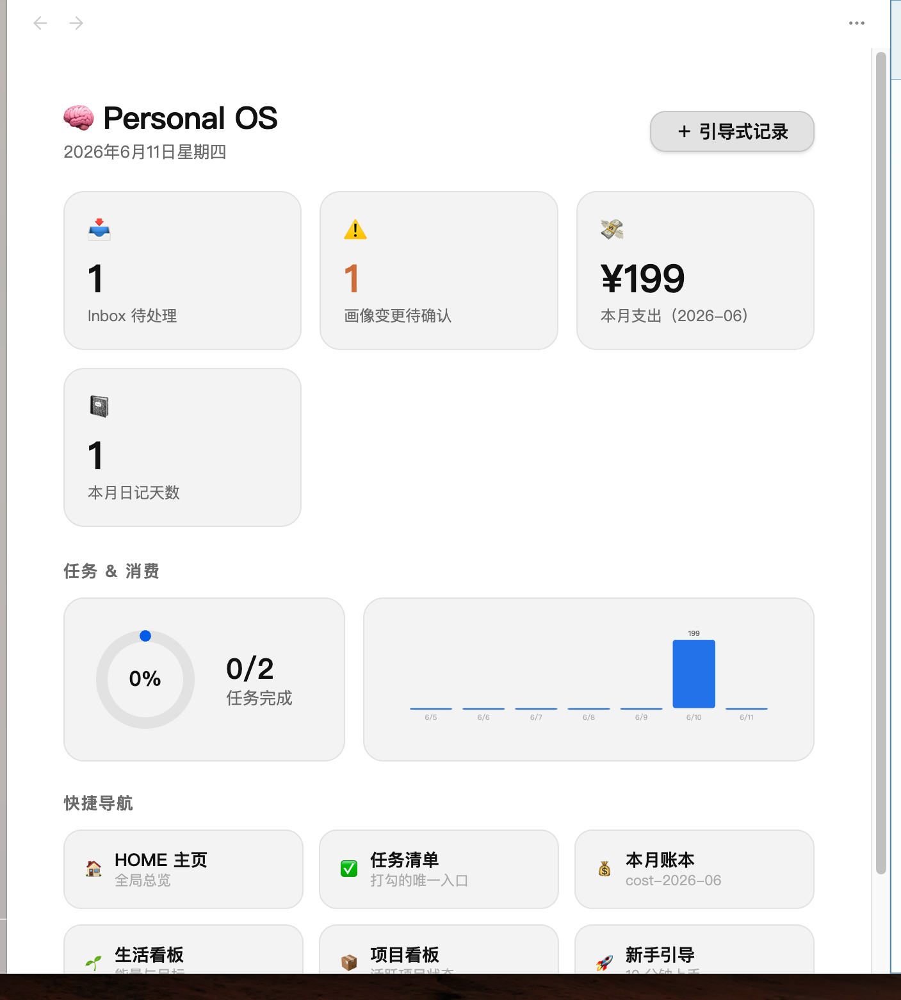
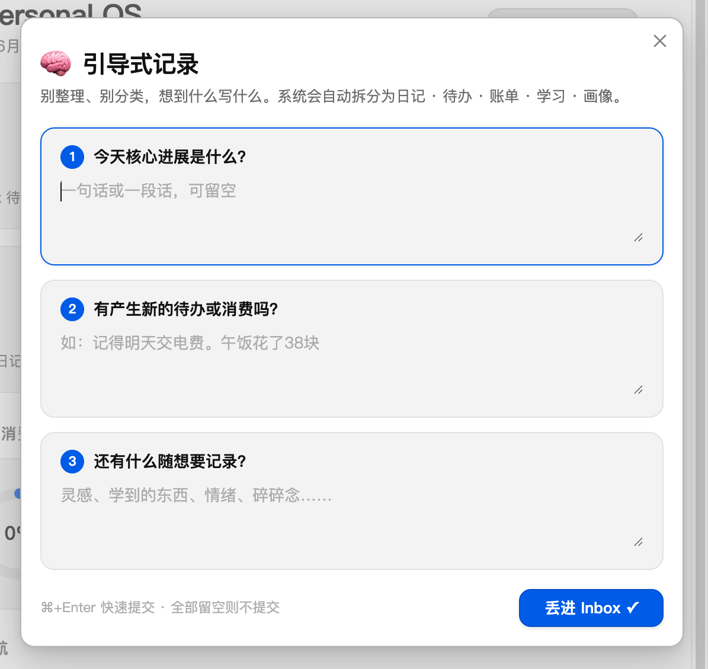

# 🧠 PERSONAL OS

[](LICENSE)
[]()
[](https://obsidian.md)
[]()

> An AI-powered second brain on plain Markdown — capture anything, let agents organize everything.
> 基于纯 Markdown 的个人 AI 操作系统：你只管丢想法，系统自动分类、归档、提醒、沉淀。

**🌐 官方介绍站：[np-os.vercel.app](https://np-os.vercel.app)** — 5 分钟看懂 NP-OS 生态、第二大脑能力与性价比对比。

**核心哲学：做减法是美德 · 系统包裹化 · 多端联动**

⭐ 如果这个项目对你有启发，点个 Star 是对它最好的支持！

## 截图

| 总览看板（自带插件） | 引导式记录 |
| --- | --- |
|  |  |

## 它解决什么问题

传统笔记系统要求你"先想清楚放哪、打什么标签"——认知负担全在你身上。
Personal OS 反过来：**唯一动作是把想法丢进 Inbox**，AI 管线自动拆分为
日记 / 待办 / 账单 / 学习笔记 / 个人画像变更，夜间管家自动归档并生成日报。

```
"今天定下了项目架构。记得明天给服务器换证书。午饭花了38块。"
                       ↓ 一次输入，自动变成：
  📓 日记一条   ✅ 待办一条（截止日自动换算）   💸 账单一笔
```

## 系统结构（5 大支柱）

```
PERSONAL OS/
├── HOME.md          # 主页看板（待办/日记/项目/账单一屏总览）
├── 01-Inbox/        # 唯一入口：一切输入先到这里
├── 02-Memory/       # 双轨记忆：dynamic 动态流 + static 静态知识库
├── 03-Agents/       # 引擎舱：rtk CLI · Hermes 夜间管家 · 自动化脚本
├── 04-Output/       # 高价值产出：周报/创作/摘要/看板
└── .system/         # 包裹化隐藏：Schema·模版·配置·日志
```

## 快速开始

```bash
git clone https://github.com/cht8987/personal-os.git
cd personal-os && ./install.sh   # 交互式安装：选择库位置 → 自动配置
```

然后：

1. 用 [Obsidian](https://obsidian.md)（免费）打开生成的库
2. 设置 → 第三方插件 → 启用「Personal OS」插件
3. 阅读库内 `START-HERE.md`（10 分钟新手引导）
4. 运行 `rtk onboard` 设定个人画像，把第一个想法丢进 Inbox 🎉

## 特性

- **五类实体自动分流**：一段凌乱语音转文字 → 日记+待办+账单+学习+画像，全自动
- **自带 Obsidian 插件**：网页级总览看板（统计卡片/消费柱状图/任务完成环/快捷导航）+ 引导式三问输入
- **零依赖引擎**：纯 Python 标准库，macOS 自带环境直接跑；无 API Key 时降级规则引擎，**绝不丢数据**
- **可插拔 LLM**：默认 DeepSeek（高性价比），一行配置切换任意 OpenAI 兼容 API
- **夜间管家 Hermes**：launchd 定时巡检（睡眠错过自动补跑），分发归档 + 日报 + 滞留告警
- **权限锁定**：S0–S3 数据分级、`private: true` 隐私铁律、AI 目录权限矩阵、画像变更须人工确认
- **多端输入**：桌面插件 / CLI / iOS 快捷指令，共用同一条管线

## NP-OS 生态

本仓库是 **NP-OS（NEW PERSONAL OS）生态** 的桌面端核心。完整生态：

| 组件 | 角色 | 入口 |
|------|------|------|
| **personal-os**（本仓库） | 桌面核心：vault 模板 + rtk 引擎 + Obsidian 插件 + Hermes 夜间管家 | `./install.sh` |
| [osmind-app](https://github.com/cht8987/osmind-app) | 移动端捕获终端：文字/语音/PDF/URL + AI 聊天 + 离线账本 + PWA | Expo / 浏览器 |
| OSMIND Gateway | 手机唯一写入口：`rtk serve`（:3001），内容提取管线 | 随本仓库 |
| Hindsight | 本地语义记忆引擎（可选）：向量检索，让 AI 记得你 | Docker |
| [NP-OS 介绍站](https://np-os.vercel.app) | 生态总览 · 第二大脑 · 性价比对比 | [np-os.vercel.app](https://np-os.vercel.app) |

第二大脑五种角色 —— **WIKI 资料库 · 笔记 · 知识管理 · 规划 · AI 个人助理** —— 共享同一套 Markdown 数据与同一条管线。这就是 OS 和 App 的区别。

## 文档

- [架构设计](docs/ARCHITECTURE.md) — 数据流、五支柱铁律、安全模型
- [移动端路线图](docs/MOBILE-ROADMAP.md) — 快捷指令 → Bot → 自有 App 三阶段
- [记忆引擎](docs/MEMORY-ENGINE.md) — 双层记忆架构与 Hindsight 对接

## 许可

MIT — 自由使用、修改、分发。Obsidian 为第三方商业软件（个人使用免费），本项目仅以其为可替换的显示层。
